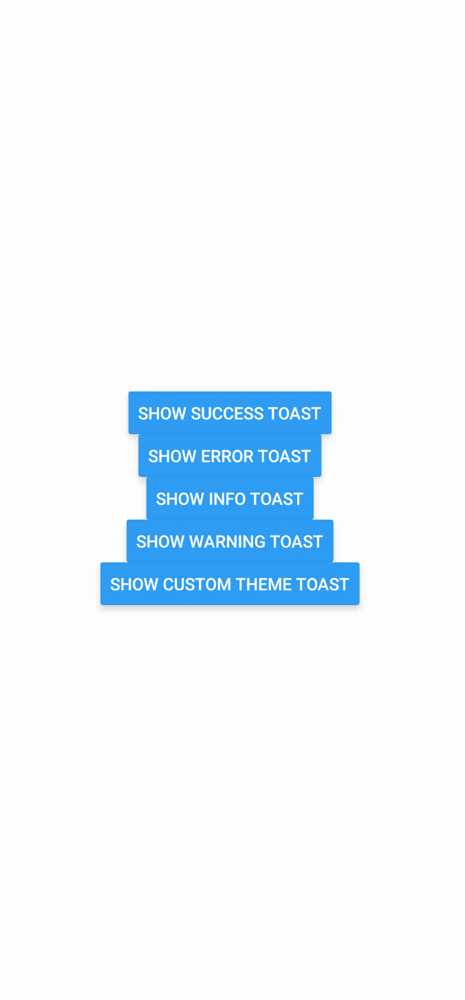
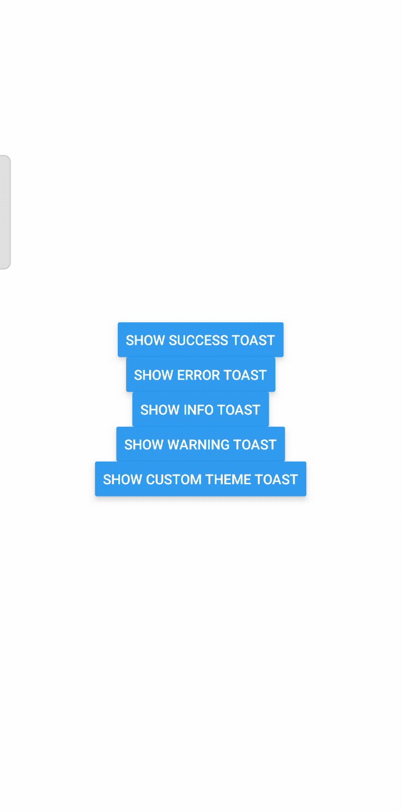

# Toast Notification Library for React Native

A customizable and lightweight toast notification library for React Native. This component supports animations, themes, dynamic positioning, and allows for multiple simultaneous toast notifications.

## Features
- **Custom Themes**: Built-in themes (`success`, `error`, `info`, `warning`).
- **Dynamic Positioning**: Supports vertical and horizontal positioning (`top`, `center`, `bottom`, `left`, `right`).
- **Smooth Animations**: Toasts appear and disappear with customizable animations.
- **Multi-Instance Support**: Display multiple toasts without overlap.
- **Custom Icons and Styling**: Add custom icons and override styles.

## Demo
---

<div style="display: flex; flex-direction: row; justify-content: space-around;">
  
  
</div>

---

## Setup

---
1. This library is available on npm. Install it with:

```bash
npm install react-native-toast-alerts
```
2. Then, you need to install and configure the libraries that are required:

```bash
npm install react-native-gesture-handler react-native-reanimated
```
also, it is recommended to use `react-native-vector-icons` when using icons:

```bash
npm install react-native-vector-icons
```

3. For iOS, ensure `pod install` is run inside the `ios` directory:

```bash
cd ios && pod install
```

---

## Usage

Since `react-native-toast-alerts` is a customizable component, it is simple to implement and extend.

### Import the Toast Component
```javascript
import Toast from 'react-native-toast-alerts'; // Adjust the path based on your setup
```

### Example Code
Here's a sample implementation to demonstrate the Toast component:

```javascript
import React, { useState } from "react";
import { View, Button, ScrollView, StyleSheet } from "react-native";
import MaterialIcons from "react-native-vector-icons/MaterialIcons";
import Toast from "react-native-toast-alerts"; // Adjust the path based on your setup

const App = () => {
  const [toasts, setToasts] = useState([]);

  const showToast = (title, message, theme) => {
    const id = Date.now(); // Unique toast ID
    setToasts((prevToasts) => [...prevToasts, { id, title, message, theme }]);

    // Auto-dismiss after 3 seconds
    setTimeout(() => {
      setToasts((prevToasts) => prevToasts.filter((toast) => toast.id !== id));
    }, 3000);
  };

  return (
    <ScrollView contentContainerStyle={styles.container}>
      <Button
        title="Show Success Toast"
        onPress={() =>
          showToast("Success", "This is a success message!", "success")
        }
      />
      <Button
        title="Show Error Toast"
        onPress={() =>
          showToast("Error", "Something went wrong!", "error")
        }
      />
      <Button
        title="Show Info Toast"
        onPress={() =>
          showToast("Info", "This is an info message!", "info")
        }
      />
      <Button
        title="Show Warning Toast"
        onPress={() =>
          showToast("Warning", "Be cautious about this!", "warning")
        }
      />
      <Button
        title="Show Custom Theme Toast"
        onPress={() =>
          showToast(
            "Custom",
            "This is a custom theme toast!",
            undefined // No predefined theme
          )
        }
      />

      {toasts.map((toast) => (
        <Toast
          key={toast.id}
          id={toast.id}
          visible={true}
          onDismiss={(id) =>
            setToasts((prevToasts) => prevToasts.filter((t) => t.id !== id))
          }
          title={toast.title}
          message={toast.message}
          theme={toast.theme}
          icon={({ color }) => <MaterialIcons name="info" size={20} color={color} />}
          closeIcon={({ color }) => (
            <MaterialIcons name="close" size={20} color={color} />
          )}
          timeout={3000}
          verticalPosition="bottom"
          horizontalPosition="center"
          direction="right"
        />
      ))}
    </ScrollView>
  );
};

const styles = StyleSheet.create({
  container: {
    flexGrow: 1,
    justifyContent: "center",
    alignItems: "center",
    padding: 20,
  },
});

export default App;
```
---

## Props

| Name                             | Type                                | Default       | Description                                                                 |
| -------------------------------- | ----------------------------------- | ------------- | --------------------------------------------------------------------------- |
| `visible`                        | `boolean`                          | `false`       | Controls the visibility of the toast.                                       |
| `onDismiss`                      | `(id: number) => void`             | `undefined`   | Callback when the toast is dismissed.                                       |
| `title`                          | `string`                           | `""`          | Title text of the toast.                                                    |
| `titleColor`                     | `string`                           | `blue`        | Color of the title text.                                                    |
| `titleSize`                      | `number`                           | `16`          | Font size of the title text.                                                |
| `message`                        | `string`                           | `""`          | Message text of the toast.                                                  |
| `messageColor`                   | `string`                           | `black`       | Color of the message text.                                                  |
| `messageSize`                    | `number`                           | `14`          | Font size of the message text.                                              |
| `maxMessageLength`               | `number`                           | `100`         | Maximum length of the message before truncating with `...`.                 |
| `backgroundColor`                | `string`                           | `white`       | Background color of the toast.                                              |
| `icon`                           | `React.ComponentType<{ color: string }>` | `undefined`   | Custom component for the icon.                                              |
| `iconColor`                      | `string`                           | `black`       | Color of the icon.                                                          |
| `closeIcon`                      | `React.ComponentType<{ color: string }>` | `undefined`   | Custom component for the close icon.                                        |
| `close`                          | `boolean`                          | `true`        | Whether the close button is shown.                                          |
| `timeout`                        | `number`                           | `3000`        | Duration (in ms) before the toast automatically disappears.                 |
| `verticalPosition`               | `'top' | 'center' | 'bottom'`      | `'bottom'`   | Vertical position of the toast.                                             |
| `horizontalPosition`             | `'left' | 'center' | 'right'`      | `'center'`    | Horizontal position of the toast.                                           |
| `direction`                      | `'top' | 'bottom' | 'left' | 'right'` | `'bottom'`   | Direction of entry/exit animation.                                          |
| `theme`                          | `'success' | 'error' | 'info' | 'warning'` | `undefined`   | Predefined theme for the toast.                                             |
| `animationDuration`              | `number`                           | `300`         | Duration (in ms) of the entry and exit animations.                          |
| `containerStyle`                 | `StyleProp<ViewStyle>`             | `undefined`   | Custom styles for the toast container.                                      |
| `onShow`                         | `(id: number) => void`             | `undefined`   | Callback when the toast is shown.                                           |
| `onHide`                         | `(id: number) => void`             | `undefined`   | Callback when the toast is hidden.                                          |

---
---

## Use Cases

This library can be used in a variety of mobile app scenarios to enhance user experience:

1. **Form Submission Feedback**:
   - Show success messages after a form is submitted successfully.
   - Display error messages if there are validation errors or network failures.

2. **Real-Time Notifications**:
   - Inform users about updates, such as new messages or alerts in a chat app.

3. **E-Commerce Applications**:
   - Notify users when items are added to the cart, orders are placed, or payment is successful.

4. **Error and Debug Messages**:
   - Alert users about runtime errors, such as API request failures or unresponsive features.

5. **Onboarding and Guidance**:
   - Provide quick tips or guidance during onboarding without requiring modals or additional screens.

6. **Custom Alerts for Events**:
   - Notify users about location-based alerts or reminders in productivity apps.

7. **Gaming Applications**:
   - Display notifications for achievements, level-ups, or warnings.

---

## Some Queries:

### How do I dismiss a toast programmatically?

Use the `onDismiss` callback to handle the dismissal of a toast programmatically. Here's an example:

```javascript
<Toast
  id={toastId}
  visible={true}
  onDismiss={(id) => handleDismiss(id)}
  title="Programmatic Dismiss"
  message="This toast will dismiss on callback."
/>
```

### How do I add custom animations?

Use the `animationIn`, `animationOut`, and `animationDuration` props to customize animations. For example:

```javascript
<Toast
  animationIn="fadeIn"
  animationOut="fadeOut"
  animationDuration={500}
/>
```

## License

This library is open-source and licensed under the MIT License.

### Thank you for checking out the react-native-toast-alerts! If you find this project helpful, please consider giving it a star on GitHub.